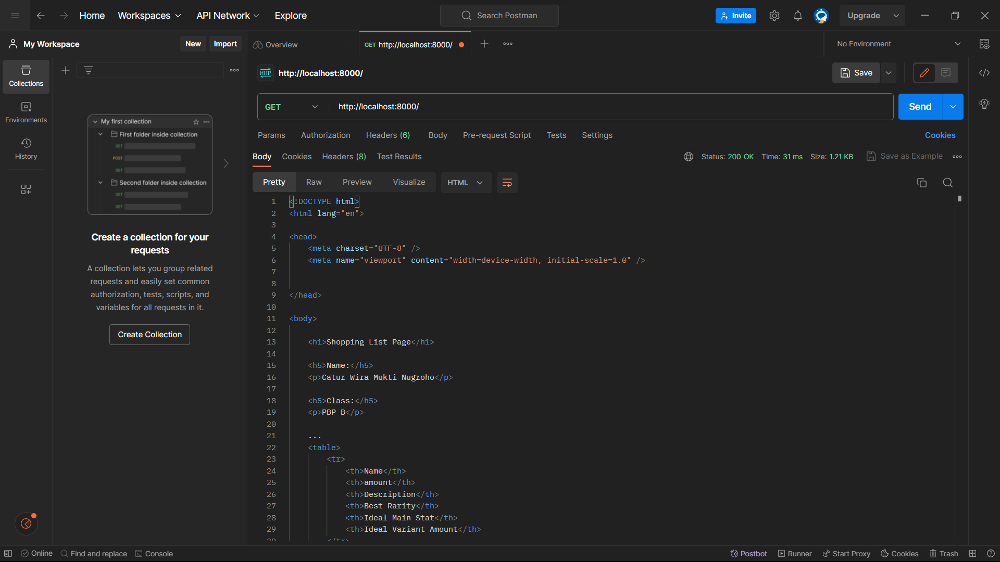
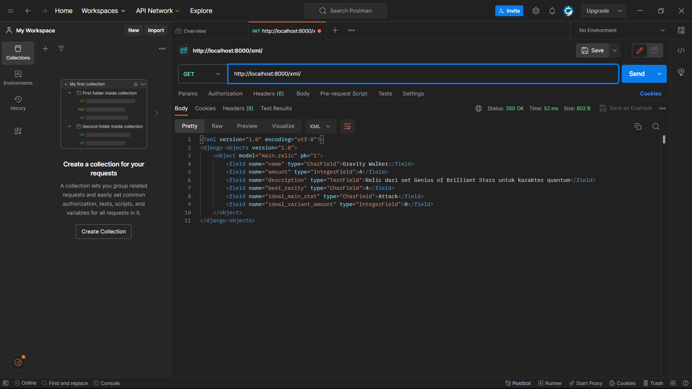
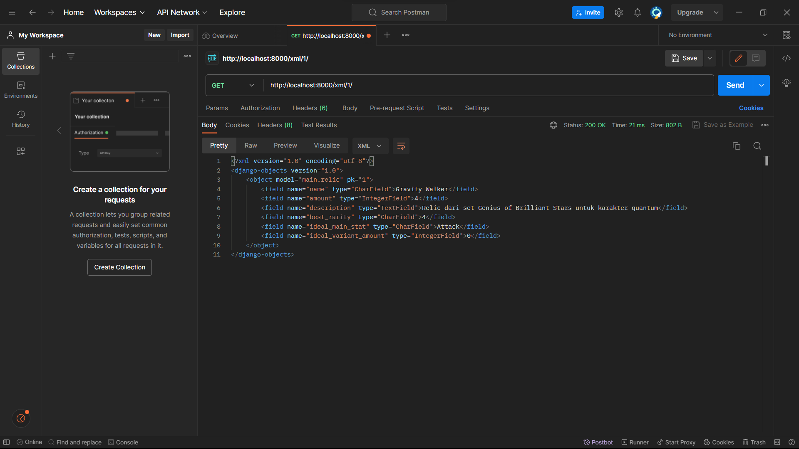
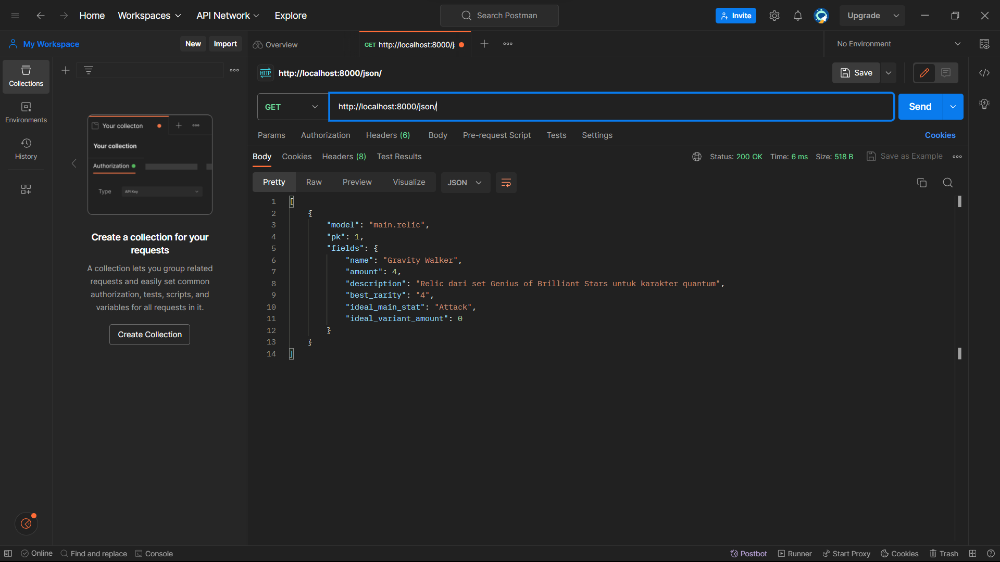
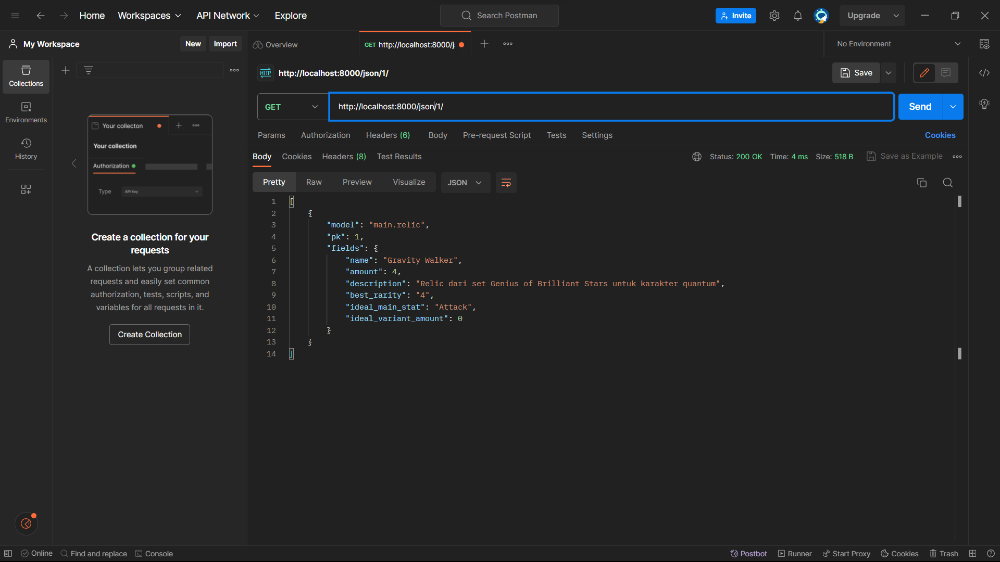
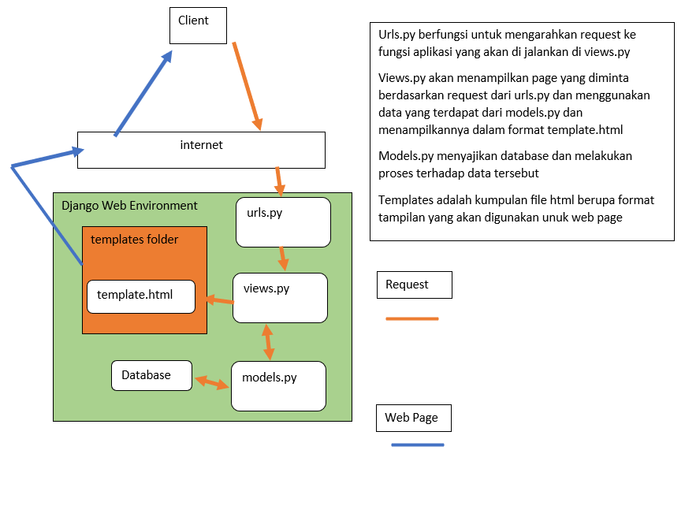

## Tugas 6

1. Synchronous programming merupakan suatu pola pemrograman dimana suatu aksi program hanya dapat berjalan ketika suatu aksi lainnya dilakukan untuk dilakukan sehingga hanya satu proses dapat berjalan dalam suatu waktu, hal ini digambarkan oleh suatu program yang menunggu suatu respon agar bisa melakukan sesuatu. Sedangkan asynchronous programming merupakan pola pemrograman dimana program dapat menjalankan berberapa aksi sekaligus sehingga ketika menunggu suatu respon, program bisa melakukan aksi lain yang diperlukan seperti mengolah data setiap sekian detik atau melakukan sesuatu tanpa perlu respon dari pengguna. 

2. Event driven programming adalah suatu paradigma pemrograman dimana program yang dibuat akan menunggu dan menerima event atau aksi yang dilakukan oleh pengguna dan mengembalikan respon yang sesuai. Salah satu contoh dari penerapannya adalah tombol add sesuatu by AJAX yang apabila ditekan akan menunjukan suatu modal dan tombol add sesuatu pada modal yang apabila ditekan akan membuat sebuah objek baru dan menampilkannya pada tabel.

3. AJAX menerapkan asynchronous programming dengan mentransfer data ke server ketika sebuah aksi terjadi dan mengubah web page dengan respon yang sesuai tanpa mereload seluruh web page tersebut dimana proses transfer data tersebut terjadi di background web page.

4. JQuery merupakan library yang mengimplementasikan AJAX sedangkan Fetch API sudah terintegrasi pada javascript. Selain itu, karena Fetch API menggunakan promise, apabila terjadi response error HTTP maka rexponse tersebut tidak akan ditolak oleh promise. Jika keduanya dibandingkan, Fetch API mungkin pilihan yang paling baik karena Fetch API sudah terintegrasi di dalam java script dan memiliki kode yang lebih simple daripada JQuery.

5. Implementasi dengan:
- Pertama dengan menambahkan id ke container inventori yang digunakan
- Lalu membuat sebuah fungsi baru untuk memperoleh data item dalam bentuk json (get item atau relic)dan memanggil fungsi di bagian scripts pada main.html secara asynchronous lalu menambahkan fungsi untuk merefresh isi container sebelumnya dengan data yang diambil dari fungsi get item tadi dan mengubah isi innerHTML-nya dengan format penampilan yang diinginkan, sayangnya href dengan parameter tambahan tidak bisa dipakai secara normal sehingga tombol edit dan delete akan hilang
- Setelah itu buatlah tombol yang berfungsi untuk menampilkan (atau toggle) sebuah modal dengan id tertentu dimana modal tersebut dibuat agar memuat form serta tombol submit dan close dengan state awal berupa hidden
- Lalu buat sebuah fungsi add item by ajax pada views.py yang akan menerima setiap masukan dari form tersebut sebagai data untuk item baru (melalui response.POST.get(id)) dan save item tersebut
- Lakukan routing fungsi tersebut di urls.py ke fungsi di scripts main.html yang akan melakukan fetch fungsi di views yang akan dijalankan apabila tombol add relic pada modal tertekan
- tambahkan kode untuk memanggil fungsi refresh yang sudah dibuat di bagian scripts
- lakukan django-admin collectstatic

## Tugas 5

1. Terdapat 3 jenis selector yang dapat digunakan, yaitu:
- Element selector yang akan mengubah kumpulan element yang memiliki nama yang sama, berguna jika ada suatu jenis element yang tampilannya harus sama seperti paragraf (p)
- Id selector yang akan mengubah suatu element dengan id tertentu, berguna untuk mengubah sebuah element khusus
- Class selector yang mengubah element-element dengan class yang sama, berguna untuk mengubah kumpulan element yang tipenya berbeda

2. Terdapat berberapa tag HTML5 yang saya ketahui, yaitu:
- header yang merupakan tag untuk bagian header dari suatu page
- nav yang merupakan tag untuk navbar dari suatu page
- aside yang merupakan tag untuk sidebar pada suatu halaman
- footer yang merupakan bagian bawah dari suatu page
- button yang merupakan tag untuk sebuah button
- meta yang merupakan tag untuk bagian metadata yang digunakan untuk file html tersebut
- body yang merupakan bagian utama dari page yang akan ditampilkan
- a yang menghubungkan suatu aksi dengan suatu link
- href yang merupakan alamat dari aksi yang dilakukan pada suatu element

3. Margin adalah panjang dan/atau lebar dari daerah whitespace yang ada di sekitar suatu element sedangkan padding adalah panjang dan/atau dari daerah yang dialokasikan untuk suatu element. Jika suatu elemen membesar, jarak margin dari element akan tetap, sedangkan jarak daerah kosong dari padding akan berkurang.

4. Tailwind adalah framework CSS dimana tampilan suatu element diatur oleh penggunaan kumpulan kelas. Jika dibandingkan dengan bootstrap, tampilan tailwind lebih fleksibel dan bervariasi dengan ukuran yang lebih ringan, namun lebih susah dipakai daripada bootstrap,sedangkan
   Bootstrap adalah framework css dimana tampilan suatu element diatur oleh fungsi yang sudah terdefinisikan. Bootstrap kurang fleksibel dan berukuran lebih besar jika dibandingkan dengan tailwind, namun penggunaannya mudah karena hanya perlu menggunakan fungsi-fungsi yang terdefinisi.
   Tailwind sebaiknya digunakan jika suatu proyek memerlukan tampilan yang sangat spesifik, sedangkan Bootstrap sebaiknya digunakan untuk membuat suatu proyek dengan lebih cepat karena tidak perlu menyusun ulang kode CSS.

5. Implementasinya dengan:
- Pertama menambahkan fungsi-fungsi tamabahan untuk page di views.py, membuat page html untuk fungsi-fungsi tersebut, lalu melakukan routing di urls.py.
- Membuat page menjadi responsif dan menambahkan CSS bootstrap dan JS pada metadata template dasar aplikasi atau proyek.
- Lalu menambahkan komponen lain pada base sesuai keinginan seperti navbar, sidebar, atau teks lainnya
- Lalu mengatur tampilan komponen pada tiap page sesuai selera di file html masing-masing seperti mengubah tampilan tombol, tabel, tulisan, dll.
   
## Tugas 4

1. Django UserCreationForm adalah sebuah form yang sudah ada pada django yang berfungsi untuk membuat akun pengguna baru. Keuntungan dari UserCreationForm adalah form tersebut sudah tersedia pada django serta sudah memiliki metode untuk memastikan password yang digunakan sudah aman. Kekurangannya adalah UserCreationForm hanya memiliki field buat nama dan password, sehingga jika diperlukan field baru, maka harus dibuat sebuah form registration yang baru secara manual.

2. Autentikasi adalah proses untuk memverifikasi identitas dari pengguna melalui login. Sedangkan otorisasi adalah suatu proses untuk memastikan apakah seorang pengguna memiliki akses terhadap hal yang akan dilakukan. Kedua hal tersebut penting agar kita dapat memastikan identitas pengguna dan mengirimkan data yang tepat untuk pengguna tersebut serta agar hanya orang yang memiliki wewenang dapat melakukan hal-hal tertentu seperti menghapus akun orang lain jika diperlukan.

3. Cookies adalah suatu data yang dikirimkan oleh server ke browser yang berfungsi sebagai implementasi dari session agar seorang pengguna mendapat data yang sesuai dengan apa yang telah ia lakukan dan agar user tidak perlu login lagi ketika tab browser tertutup. Di dalam django, Cookies di implementasikan sebagai kumpulan data yanga akan dibaca oleh database session pada django dan akan diubah berdasarkan apa yang telah dilakukan oleh user dan akan dikirim lagi ke browser pengguna sebagai cookies

4. Secara default, cookies aman karena hanya bisa diakses oleh browser dan datanya akan dihapus ketika browser ditutup sehingga data dari cookies tidak disimpan di tempat yang bisa dibaca di hardware pengguna.

5. Implementasi yaitu dengan
- Membuat fungsi register, login dan logout pada views.py dengan mengimport bagian yang perlu (UserCreationForm, authenticate, login, logout, dll) ,melakukan routing fungsi tersebut di urls.py applikasi serta menambahkan halaman untuk register dan login serta tombol tambahan untuk logout di halaman utama serta membuat halaman utama memerlukan login dengan login_required
- logout (jika belum) lalu buatlah 2 akun dan isi item di tiap akun dengan 3 item dengan logi terlebih dahulu
- mengubah model dari item agar memiliki parameter berupa user dengan Foreignkey dan mengubah create_relic (atau item) untuk menerima user yang menambahkan item sebagai pemilik item tersebut dan membuat show_main hanya menunjukan item pengguna
- Mengimport datetime pada views.py lalu menambahkan cookies pada response ketika user valid dengan response.set_cookie('nama cookie', waktu dengan datetime) dan menambahkan last login untuk menampilkan siapa yang terakhir login di show main dan menambahkannya di template main serta membuat fungsi logout menghapus cookies

 ------------------------------

## Tugas 3

1. Form POST berfungsi untuk menambahkan suatu data ke dalam page dimana data dari form tersebut akan disimpan ke server dan tidak bisa dibaca oleh user kecuali data tersebut ditampilkan di page secara langsung
   sedangkan Form GET akan menghasilkan data yang disimpan dalam bentuk berupa url dari page yang disisipkan permintaan pengguna sehingga bisa mudah di akses jika di bookmark, namun kurang aman karena bisa       
   dilihat secara langsung melalui url-nya

2. Perbedaannya antara lain
  - Dalam penyimpanan data, JSON baik untuk menyimpan data terkait objek dan lebih mudah dibaca karena tidak perlu menggunakan end tag, JSON juga bisa menggunakan array dan memiliki performa lebih baik untuk penggunaan AJAX
  - Jika dibandingkan dengan JSON, XML lebih baik untuk menyimpan suatu kumpulan data yang terstruktur. XML juga lebih aman, bisa memiliki namespace agar tidak terjadi konflik pada data, bisa dimasukkan dengan comment untuk penjelasan kode jika diperlukan, serta bisa memakai Encoding selain UTF-8
  - HTML Sendiri lebih berguna untuk menjadi format dasar penampilan suatu page karena bisa menampilkan data secara terstruktur dan fungsi utamanya memang untuk ditampilkan pada web (bisa memiliki header dll).

3. JSON Sering digunakan untuk transfer data karena jika dibandingkan dengan XML, JSON lebih ringan terutama jika suatu web memanfaatkan AJAX yang memungkinkan web asinkronus. JSON sendiri berasal dari bahasa JavaScript sehingga proses konversi JSON ke JavaScript cepat.

4. Langkah-Langkah Implementasi:
- Pertama, membuat sebuah base template dan meroute template tersebut melalui settings.py dan mengatur template lainnya untuk mengikuti (atau mengextend) base template tersebut
- Lalu, membuat file forms.py yang berisi class form dan class metadata yang berisi informasi tentang jenis item yang akan dibuat beserta atribut-atribut yang perlu diisi secara manual
- Terus membuat fungsi baru untuk membuat item baru dengan menggunakan forms.py dan model form yang digunakan di views.py dan menghubungkannya ke sebuah template baru yang berisi format penampilan form beserta tombol pembuatan item yang diinginkan.
- Lalu sesuaikan main.html agar bisa menampilkan data dari item yang dimiliki
- Lalu membuat 4 fungsi baru dengan memanfaatkan HTTPResponse dan Serializers untuk mengubah data yang diinginkan menjadi data XML, data JSON, serta kedua fungsi tersebut yang menerima id dari data dan melakukan routing pada urls.py agar dapat mengakses tiap halaman yang digunakan oleh fungsi-fungsi tersebut(termasuk create item jika belum

5. Screenshot:
-main

- xml

- xml with id

- json

- json with id

------------------------------

## Tugas 2

# relic-tracker
[Relic Tracker Link](https://relic-tracker.adaptable.app/main/)
---

Langkah-langkah Implementasi:
1. Membuat proyek django baru :
- Dilakukan dengan membuat direktori dengan nama yang diinginkan
- Menyusun daftar aplikasi yang diperlukan (termasuk django)
- Menginstallnya menggunakan pip install di virtual environment
- Menginisiasi proyek dengan django-admin startproject (namaproyek) .
- Lalu mensetting allowed hostu

2. Membuat aplikasi baru bernama main
- Pergi ke cli dan ketik (di venv) python manage.py startapp main

3. Melakukan routing pada proyek agar menjalankan apliikasi main :
- Pergi ke settings.py proyek dan masukkan main ke dalam list INSTALLED_APPS

4. Membuat model pada aplikasi main dengan nama Item:
Mengubah isi models.py pada main dan memasukkan:
- From django.db import models jika belum ada
- Lalu inisiasi class Item dengan Class Item(models.Model) :
- Lalu tambahkan atribute didalamnya dengan nama_atribute = ditambah: 
  models.CharField untuk charfield
  models.DateField untuk Datefield
  dan seterusnya
- Terakhir, melakukan migration 

5. Membuat fungsi pada views.py:
- Jika belum membuat main.html yang berisi data nama, kelas, dan app pada direktori templates di main, maka di buat dulu
- Setelah itu buka views.py pada main dan isi dengan:
  from django.shortcuts import render jika belum ada
  Lalu, tambahkan fungsi show_main yang berisi context dengan parameter request
  Context berisi data yang akan menggantikan field data pada template
  Fungsi mereturn render(request, 'nama_template', context)
  Jika belum, ubahlah data pada templates dengan data field ({{ data }}) yang sesuai

6. Routing urls.py:
- Buat file urls.py pada file app (main) dan import path dari django.urls, dan fungsi
- show_main (atau fungsi render lain) dari main.views atau .views
- masukan app_name = 'main'
- dan masukan urlpatterns = \[path('', show_main, name='show_main')]
- pindah ke urls.py di file proyek yang mengatur interaksi aplikasi dengan web
- tambahkan include disamping import path yang sudah ada
- lalu masukan path('main/', include('main.urls')) pada urlpatterns

7. Deploy app adaptable:
- buat aplikasi baru di adaptable dengan menggunakan repositori proyek
- gunakan template python, dan hosting PostgreSQL
- sesuaikan versi python dan tambahkan start command
  python manage.py migrate && gunicorn (nama proyek).wsgi
- centangkan HTTP listener dan tunggu

8. Buat README.md:
- tinggal add file README.md di direktori dan add commit push

Bagan MVT Django:

Virtual Environtment:
- Virtual environtment kita gunakan dalam pembuatan proyek django agar project 
kita bisa berjalan dengan menggunakan file-file yang memiliki versi python atau django yang berbeda-beda
- Selama kita tidak menggunakan file yang menggunakan versi python atau django yang berbeda-beda, seharusnya
kita tetap bisa membuat aplikasi web, namun jika kita menggunakan file dengan versi django yang berbeda, akan
terjadi banyak error

MVC(Model View Controller)
- MVC adalah pola desain software dimana digunakannya komponen berupa controller yang mengendalikan hubungan antara model dan view serta sekaligus menjadi pusat aplikasi yang menerima permintaan dari user melalui view dan mengubah model berdasarkan permintaan. Model menyimpan data dan view menampilkan UI untuk pengguna. Tiap bagian pada MVC terikat erat sehingga susah di modifikasi. Baik untuk proyek skala kecil

MVT(Model View Template)
- MVT adalah pola desain web dimana digunakannya views untuk menerima dan membalikan request dari pengguna melalui template yang menjadi bagian yang menampilkan data dalam bentuk kode html. Karena bagian-bagiannya tidak terikat erat, modifikasi mudah. Bagian yang dilakukan oleh controller pada MVC di tangani oleh framework pada MTV. Model juga tetap bekerja sebagai penyimpanan data atau database. Baik untuk proyek kecil dan besar.

MVVM(Model View ViewModel)
- MVVM adalah pola desain software dimana digunakannya ViewModel yang berfungsi sebagai hubungan dari view dan model dimana bagian view hanya bekerja untuk menerima input pengguna dan membalikan data yang sesuai dari viewmodel. Viewmodel sendiri menerima input dari view dan menyampaikannya ke model dan mengirim balasan dari model ke view. Model tetap bekerja sebagai database. mudah di modifikasi namun bisa susah untuk dilakukan 'debugging'. Baik untuk proyekk skala besar
